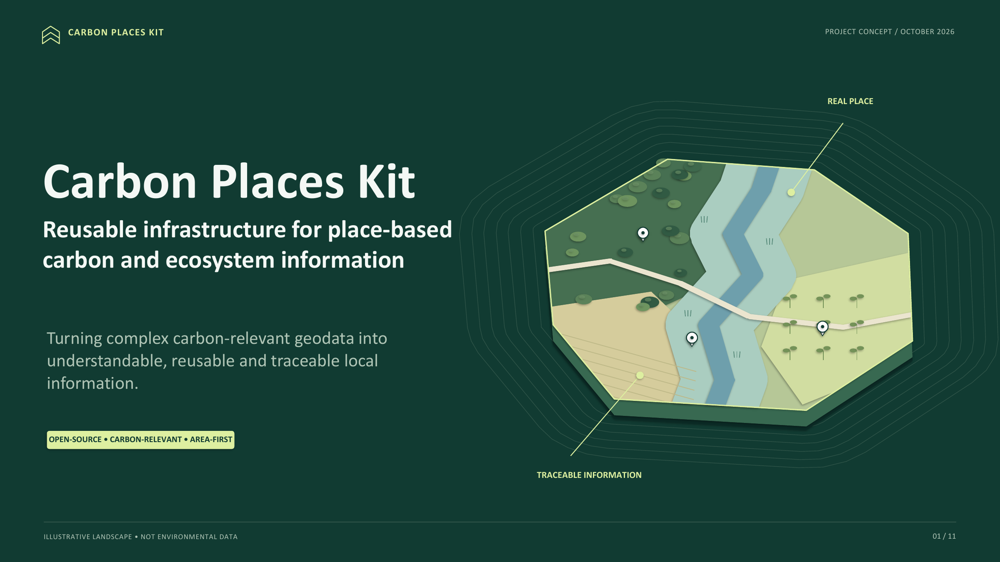
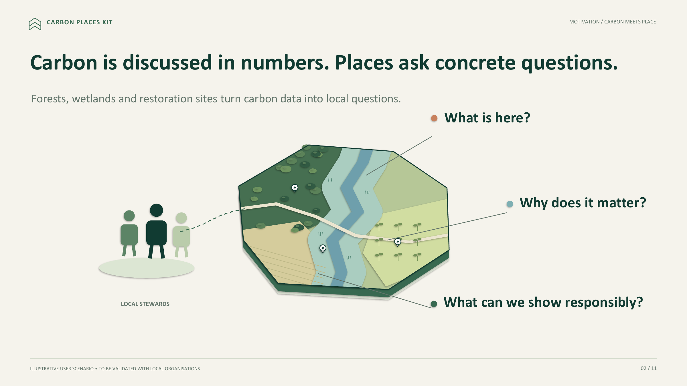
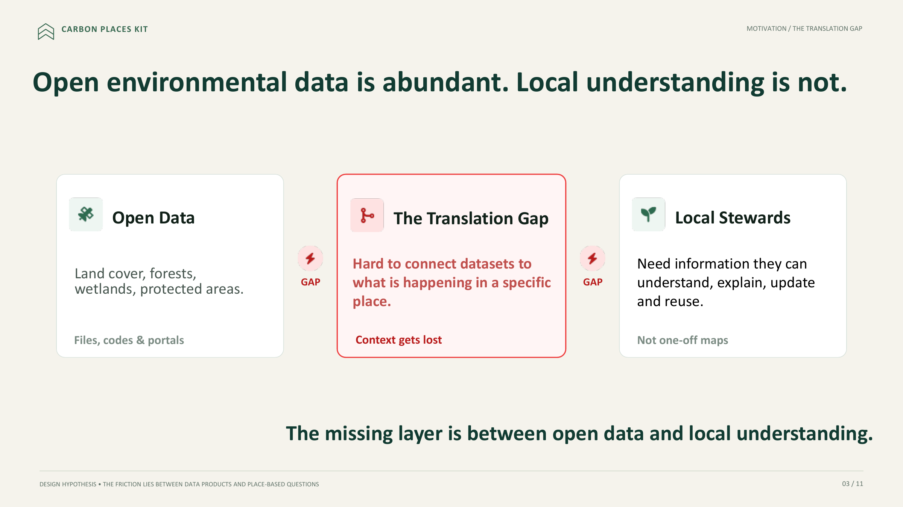
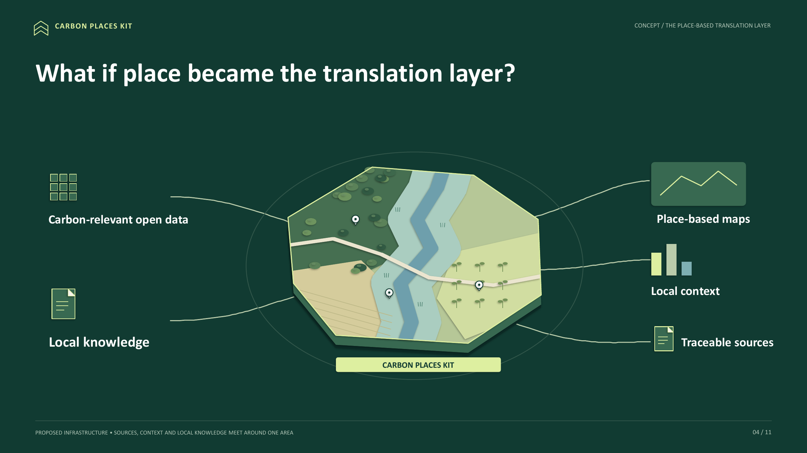
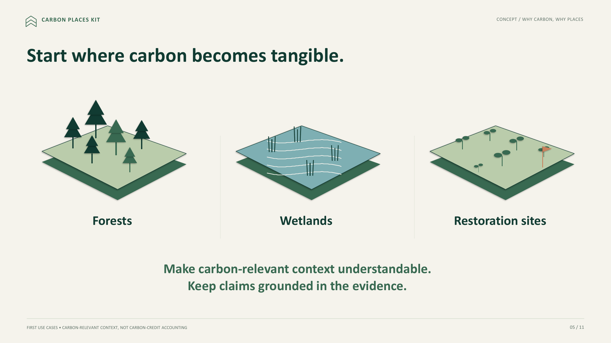
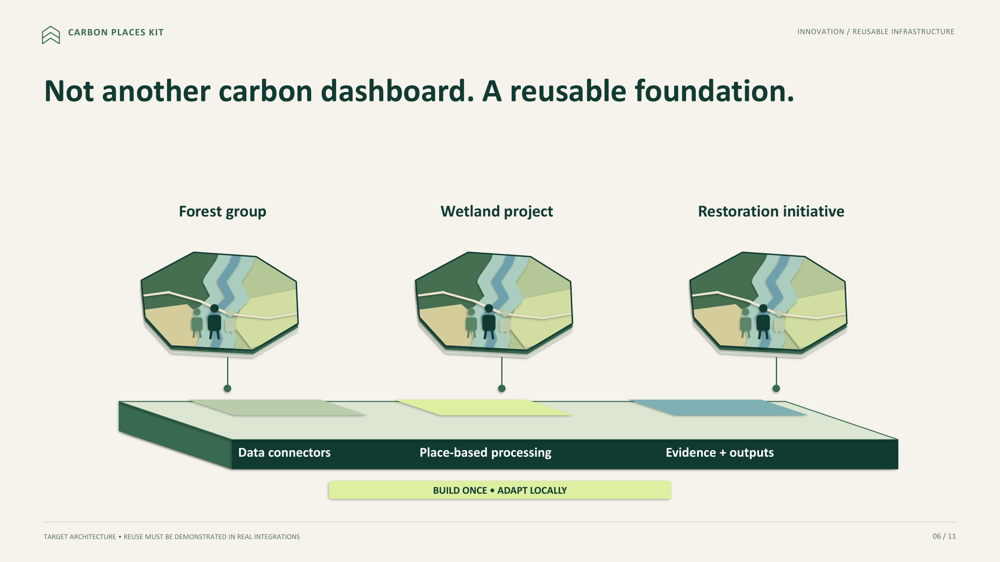
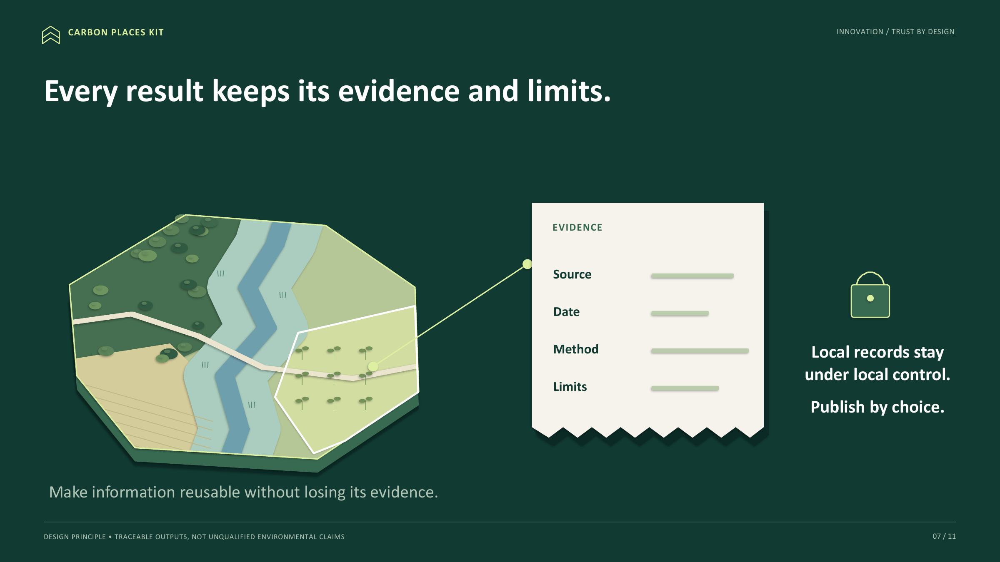
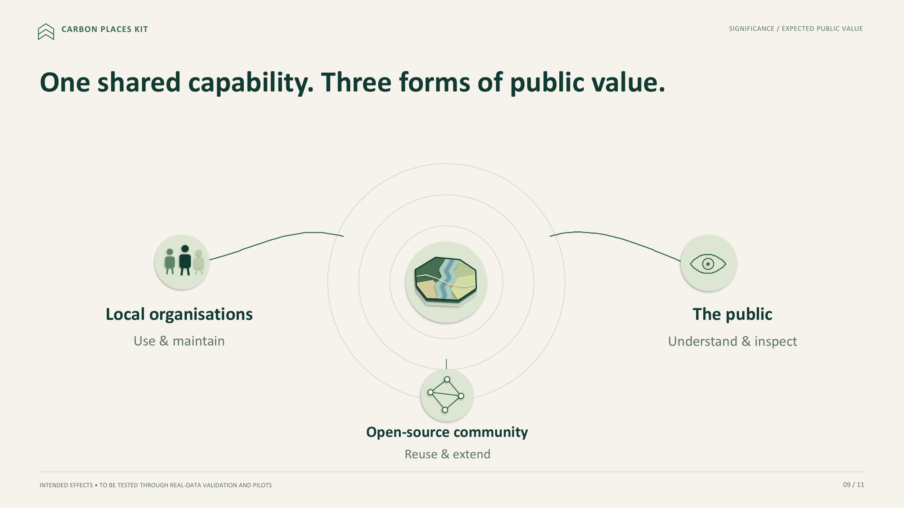
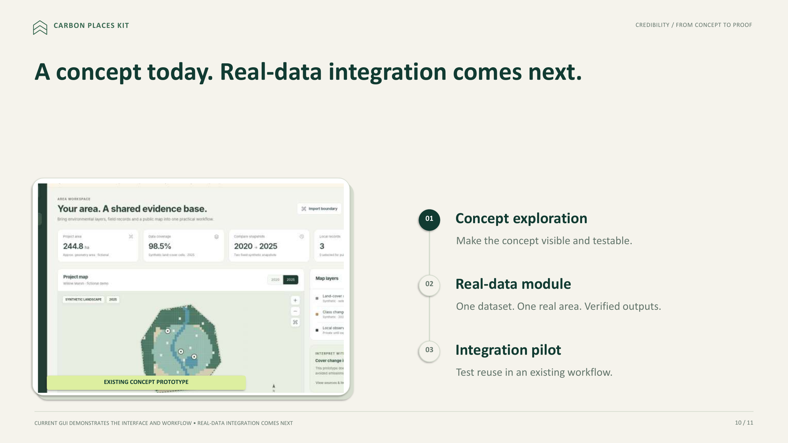
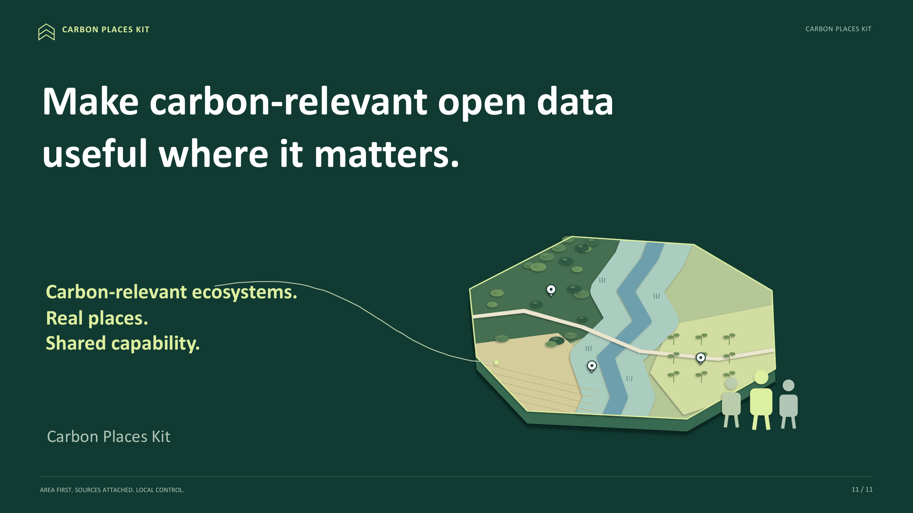

# Carbon Places Kit

**Reusable infrastructure for place-based carbon and ecosystem information.**

Carbon Places Kit is an open-source project concept for turning complex carbon-relevant geodata into understandable, reusable, and traceable local information.

The project focuses on a practical gap between open environmental data and local use: datasets, portals, and code may already exist, but it is still difficult to connect them to what is happening in a specific place, preserve the evidence behind each result, and reuse the same workflow across different local contexts.

## Project concept

### 01 — Project overview

### 02 — Carbon meets place

### 03 — The translation gap

### 04 — The place-based translation layer

### 05 — Why carbon, why places

### 06 — Reusable infrastructure

### 07 — Trust by design

### 08 — Expected public value

### 09 — From concept to proof

### 10 — Carbon Places Kit

**Project concept — October 2026**

[View PDF](docs/project-concept/Carbon_Places_Kit_Concept.pdf) · [Download PowerPoint](docs/project-concept/Carbon_Places_Kit_Concept.pptx)

## Core idea

Carbon Places Kit treats **place as the translation layer** between environmental data and local understanding.

The intended reusable foundation combines:

- **Data connectors** for carbon-relevant open data
- **Place-based processing** around a user-defined area
- **Evidence-aware outputs** that keep source, date, method, and limitations attached
- **Local control** over local records and publication choices

The project is not intended to be another standalone carbon dashboard. The goal is to build reusable software components that can be adapted to existing workflows and local projects.

## First use cases

Initial use cases focus on places where carbon becomes tangible:

- Forests
- Wetlands
- Restoration sites

The emphasis is on making carbon-relevant context understandable while keeping claims grounded in the available evidence. The project is **not designed as a carbon-credit accounting system**.

## Design principles

- **Area first** — start from a real place or project boundary.
- **Sources attached** — outputs remain traceable to their evidence.
- **Local control** — local records stay under local control and are published by choice.
- **Reusable by design** — build shared capabilities rather than one-off maps.
- **Carbon-relevant, not claim-heavy** — communicate what the data can support, including its limits.

## Current status

Carbon Places Kit is currently at the **concept exploration / prototype stage**.

The next development steps are:

1. **Concept exploration** — make the concept visible and testable.
2. **Real-data module** — connect one real dataset to one real area and verify the outputs.
3. **Integration pilot** — test whether the reusable components can be integrated into an existing workflow.

## Project concept materials

- [Project concept PDF](docs/project-concept/Carbon_Places_Kit_Concept.pdf)
- [Editable PowerPoint](docs/project-concept/Carbon_Places_Kit_Concept.pptx)

## Intended public value

The project aims to create one shared capability that can support three groups:

- **Local organisations** — use and maintain place-based environmental information
- **The public** — understand and inspect environmental context
- **Open-source developers** — reuse and extend the underlying components

---

**Carbon-relevant ecosystems. Real places. Shared capability.**
